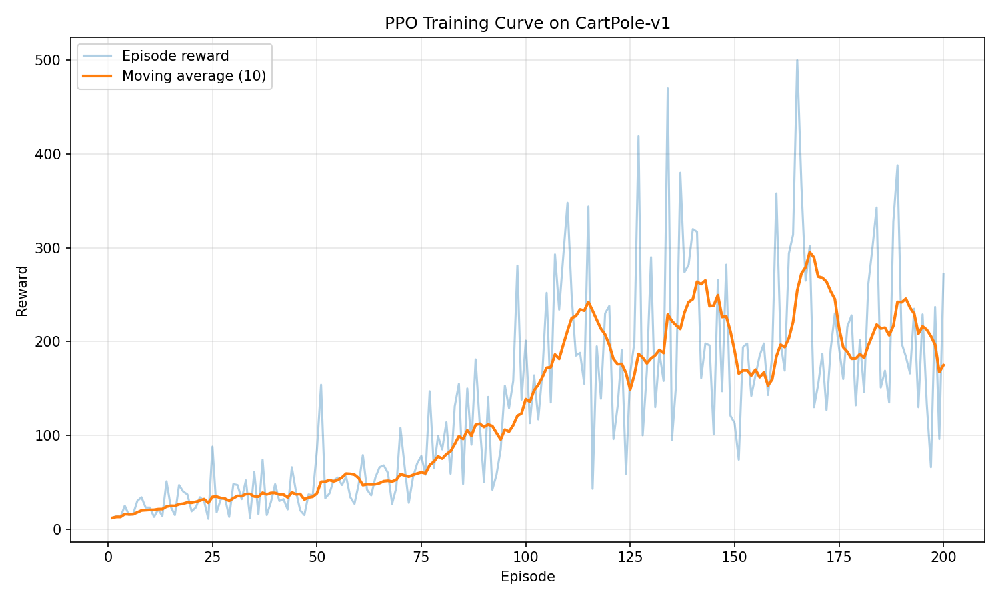

# Reproducible RL Benchmark: PPO vs SAC vs TD3

## Overview

This project aims to reproduce and benchmark three popular reinforcement learning algorithms:

- Proximal Policy Optimization (PPO)
- Soft Actor-Critic (SAC)
- Twin Delayed Deep Deterministic Policy Gradient (TD3)

Evaluating their performance on continuous control tasks under controlled and reproducible
conditions.

---

## Results

### PPO on CartPole-v1

The PPO implementation successfully solves CartPole-v1 during deterministic evaluation.

- Best evaluation reward: **500.0**
- Environment: `CartPole-v1`
- Policy: MLP with categorical action distribution
- Advantage estimation: GAE

---

## Goals

- Compare sample efficiency
- Evaluate training stability
- Analyze sensitivity to hyperparameters
- Ensure full reproducibility

---

## Environments

- CartPole-v1 (sanity check)
- LunarLanderContinous-v2
- BipedalWalker-v3

---

## Methodology

- Fixed random seeds
- Identical network architectures where possible
- Same evaluation protocol across algorithms

---

## Metrics

- Average return
- Training stability (variance)
- Sample efficiency

---

## Status

Work in progress – PPO implementation ongoing.
