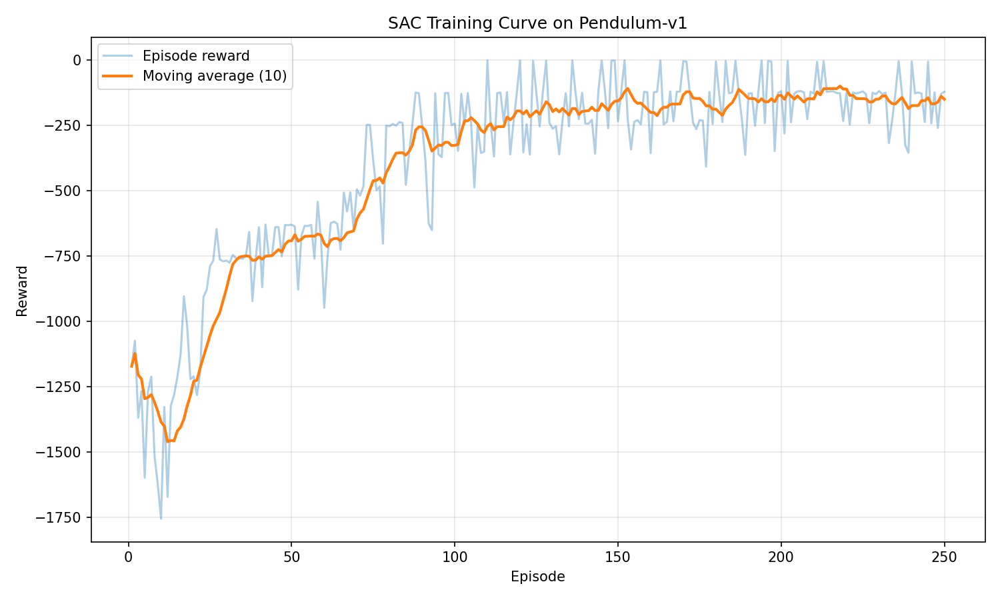
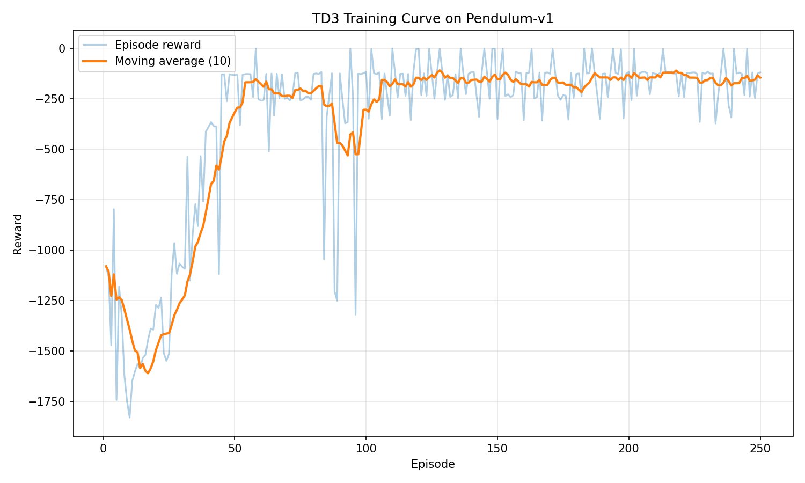

# Reproducible RL Benchmark: PPO vs SAC vs TD3


---

## Overview

This project implements reinforcement learning algorithms from scratch with the goal of analyzing
their behavior, performance, and reproducibility across environments:

The focus is on building a clean, research-oriented RL framework rather than relying on
high-level libraries.

---

## Results

### PPO on CartPole-v1

The PPO implementation successfully solves CartPole-v1 during deterministic evaluation.

- Best evaluation reward: **500.0**
- Training episodes: 200
- Environment: `CartPole-v1`
- Policy: MLP with categorical action distribution
- Advantage estimation: GAE
- Mini-batch PPO updates


### SAC on Pendulum-v1

The SAC implementation trains on the continuous-control `Pendulum-v1` environment using an off-policy replay buffer and entropy-regularized actor-critic updates.

- Environment: `Pendulum-v1`
- Action space: continuous
- Replay buffer: enabled
- Twin Q-networks: enabled
- Automatic entropy tuning: enabled
- Target networks with Polyak averaging: enabled



### TD3 on Pendulum-v1

The TD3 implementation addresses overestimation bias in Q-learning by using twin critics and delayed policy updates.

Key features:

- Deterministic actor (DDPG-style)
- Twin Q-networks (clipped double Q-learning)
- Target policy smoothing
- Delayed policy updates
- Polyak averaging for target networks

Environment:

- `Pendulum-v1`
- Continuous action space



---

## Highlights

- PPO implemented from scratch (no RL libraries)
- Achieves maximum score (500) on CartPole-v1
- Built with reproducibility and research structure in mind

---

## Project Goal

The main objective is to

- Implement core RL algorithms from scratch
- Reproduce and analyze their learning behavior
- Compare performance across different methods and environments
- Build a reproducible and extensible RL experimentation framework

---

## Implemented Algorithms
- Proximal Policy Optimization (PPO) - from scratch
- Soft Actor-Critic (SAC) - from scratch
- Twin Delayed DDPG (TD3) - from scratch

---

```
## Project Structure

```text
rl-reproducibility-study/
├── assets/
├── configs/
│   └── ppo.yaml
├── experiments/
│   ├── results/
│   └── plots/
└── src/
    ├── algorithms/
    │   ├── ppo/
    │       ├── agent.py
    │       ├── model.py
    │       └── buffer.py
    ├── training/
    │   └── train.py
    └── utils/
        ├── logger.py
        ├── seed.py
        └── plot_training.py
```

---

## Features

- Deterministic evaluation
- Checkpointing of best model
- Multi-episode rollouts
- Mini-batch PPO optimization
- CSV logging
- Automatic experiment tracking (`run_XXX`)
- Training curve visualization
- Off-policy replay buffer for SAC
- Gaussian policy with tanh-squashed actions
- Twin Q-networks
- Automatic entropy temperature tuning
- Target network soft updates
- TD3 implementation with delayed policy updates
- Target policy smoothing for improved stability
- Shared replay buffer across off-policy methods
- Modular architecture for easy algorithm comparison

---

## Reproducibility

- Fixed random seeds
- Config-based experiment setup
- Separated training and evaluation
- Structured experiment logging

---

## Installation

```
git clone https://github.com/SyleKu/rl-reproducibility-study
cd rl-reproducibility-study
python -m venv .venv
source .venv/bin/activate
pip install -r requirements.txt
python -m src.training.train
python -m src.utils.plot_training

```
---

## Future Work

- Multi-seed evaluation for PPO, SAC, TD3
- Statistical comparison across algorithms
- Benchmark vs Stable-Baselines3
- Add more environments (HalfCheetah, Walker2D)
- Hyperparameter sweeps
